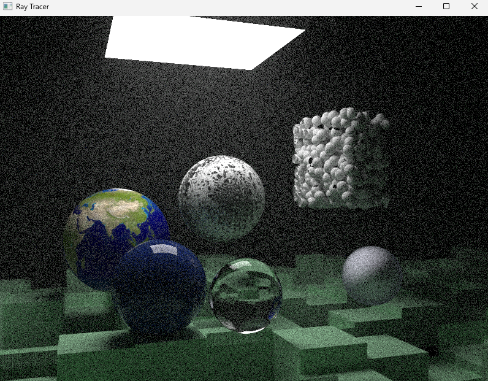
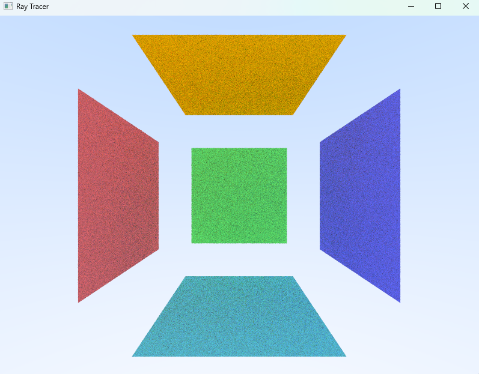
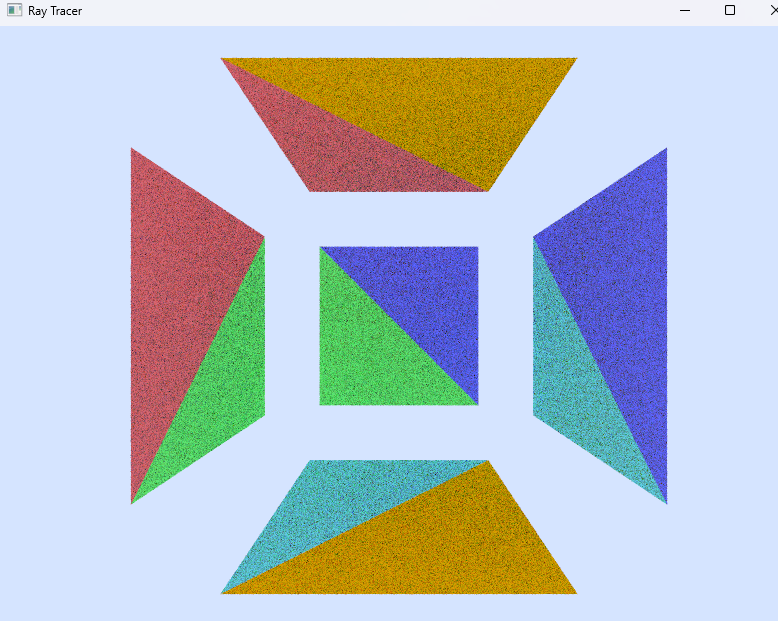
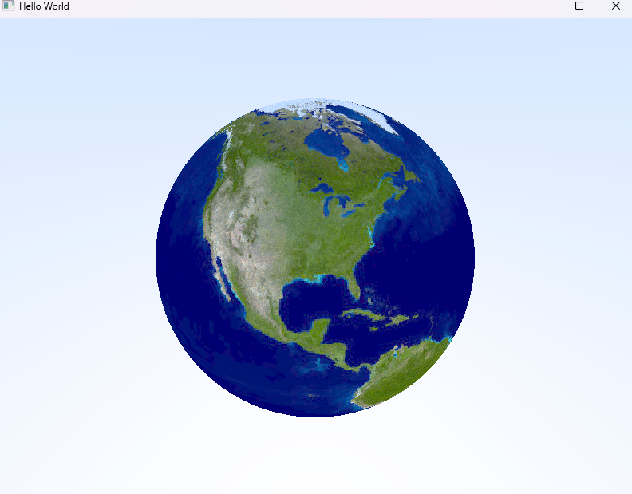
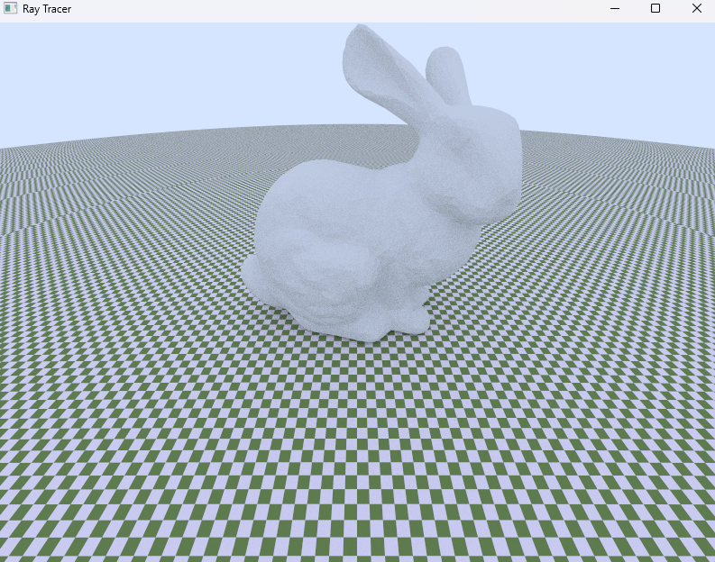

# TinyRayTracer

## Implemented Features

- BVH加速

- 蒙特卡洛积分与重要性采样

only importance sampling

&nbsp;

mixed sampling

&nbsp;
- 多种BSDF材质

&nbsp;
- 光源（目前仅实现：面光源，球光源）

&nbsp;
- 多种几何体（包括：平面，三角形，球，基于三角面片的Mesh）

Quad

Triangle

Sphere with Texture Mapping

Mesh

